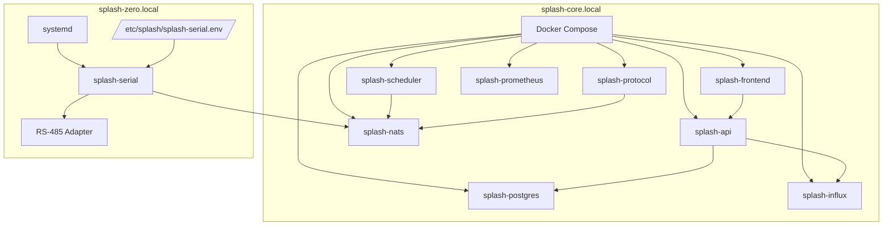

# Deployment Architecture

[Back to README](Home)

## Purpose

This document defines how Splash is deployed across hosts, runtimes, and supporting infrastructure.

## Deployment model



### `splash-core`

- Raspberry Pi 4/5, arm64
- Docker Compose runtime using package-backed service images
- mDNS hostname: `splash-core.local`
- Exposes NATS across the LAN
- the current lab host for `splash-core` deployment is `automa` at `10.0.40.52`

### Developer-local milestone topology

For milestone-1 implementation work, the preferred developer bring-up may run
`splash-frontend`, `splash-api`, `splash-protocol`, and NATS on the developer
machine while leaving `splash-serial` on the hardware host that owns the live
RS-485 adapter.

Rules:

- local developer NATS must be reachable by the host-side `splash-serial`
- local developer runs are valid for milestone-1 browser, API, and protocol
  validation
- local helper bring-up may start `splash-frontend`, `splash-api`,
  `splash-protocol`, and NATS together on the developer machine for one-command
  dashboard validation
- `splash-serial` remains host-deployed because the local development machine is
  not assumed to have the required FTDI or RS-485 TTY hardware
- this topology is a development workflow, not the long-term production runtime

### `splash-zero`

- Raspberry Pi Zero 2W, arm32/armv7
- Native service installed from an OS package and managed by `systemd`
- mDNS hostname: `splash-zero.local`
- Connects to NATS at `nats://splash-core.local:4222`
- The target host may run either an `armv7` or `arm64` Debian-family userspace, but `splash-serial` v1 packages are published as `armhf`

## Compose and host layout

### Core host Compose responsibilities

- `splash-core/docker-compose.yml` runs all services except `splash-serial`
- Compose services should consume prebuilt, versioned package-backed images rather than building directly from unchecked source on the host
- NATS binds to `0.0.0.0:4222` for LAN clients
- API binds to `0.0.0.0:8080`
- Frontend binds to `0.0.0.0:3000`
- PostgreSQL, InfluxDB, and Prometheus remain internal-only
- Prometheus scrape configuration should target `splash-protocol` on `splash-core` and `splash-serial` on its local health and metrics listener, with optional later targets for `splash-api` and NATS monitoring when those surfaces are formalized

### Pi Zero runtime

- `splash-zero` uses a `systemd` unit instead of Docker
- Runtime configuration comes from `/etc/splash/splash-serial.env`
- `splash-serial` should be installed from an OS package rather than a manually copied binary
- `splash-serial` exposes a small local HTTP listener for health and Prometheus metrics
- Repository deployment assets for this host live under `deploy/splash-zero/`, including the Debian-package build inputs for `splash-serial`
- Ansible automation assets for this host should live under `deploy/ansible/`
- milestone-1 developer bring-up may temporarily point `NATS_URL` at a
  developer machine instead of `splash-core.local`

## Artifact and distribution model

Splash prefers package-based artifacts across both hosts.

### Package-first rules

- versioned packages are the preferred release artifact for services
- host-native services such as `splash-serial` should prefer OS-native packages, with Debian packages as the expected v1 path on Raspberry Pi hosts
- containerized services on `splash-core` should still originate from versioned packaged service builds wherever practical, with OCI images treated as the deployment wrapper rather than the only distributable artifact
- deployment automation should install or assemble from published packages instead of compiling from source on production hosts
- Gitea package publishing is the preferred internal distribution mechanism for release artifacts
- package publication should happen on every merge to `main`
- semver tags publish stable artifacts, while merges to `main` publish prerelease artifacts

### Registry mapping

- Debian registry: host-installed packages such as `splash-serial`
- Container registry: runtime images for containerized services on `splash-core`
- Package registry: intermediate application packages, such as Node package artifacts that are later assembled into container images
- for v1, `splash-serial` Debian packages should publish into the `bookworm` distribution and `main` component of the Gitea Debian registry

### Naming and ownership

- the initial package namespace is `devinrader`
- published package names should match service names exactly where practical, such as `splash-serial`, `splash-api`, `splash-scheduler`, `splash-protocol`, and `splash-frontend`

### Versioning and promotion

- tagged releases use stable semver versions such as `0.1.0`
- merge builds on `main` use semver-based prerelease versions
- prerelease versions should include enough branch, date, or commit information to stay unique and sortable
- deployment automation should default to stable versions unless explicitly configured to consume prerelease builds

### Retention and rollback

- retain the most recent 25 published versions per service and channel
- rollback should be performed by redeploying or reinstalling a previously retained version from the registry

### Package examples

- `splash-serial`: Debian package installed on `splash-zero`, enabling consistent placement of the binary, `systemd` unit, and default config assets
- `splash-api`, `splash-scheduler`, `splash-protocol`, `splash-frontend`: versioned service packages that can be embedded into container images used by Compose on `splash-core`
- `splash-nats`: infrastructure image remains containerized, but release and deployment should still prefer versioned artifacts over host-local ad hoc builds

### Configuration ownership

- package-installed configuration files should be samples or defaults, not the authoritative environment-specific runtime config
- Ansible should render the live environment-specific configuration on target hosts
- local manual edits should not be the primary configuration management path

### Example environment variables

```dotenv
POSTGRES_DB=splash
POSTGRES_USER=splash
INFLUXDB_ORG=splash
INFLUXDB_BUCKET=pool_data
NATS_URL=nats://splash-nats:4222
WEATHER_PROVIDER=tomorrowio
WEATHER_API_KEY=your_key_here
POOL_ZIP_CODE=28052
SERIAL_DEVICE=/dev/ttyUSB0
PROTOCOL_PLUGIN=pentair_easytouch
SERIAL_RECONNECT_INTERVAL_MS=10000
SERIAL_WRITE_TIMEOUT_MS=2000
SERIAL_HTTP_BIND=127.0.0.1:9108
SERIAL_DEFAULT_IDLE_MS=50
LOG_LEVEL=info
TZ=America/New_York
```

### Serial-service configuration expectations

- `SERIAL_DEVICE` identifies the RS-485 adapter path
- `NATS_URL` points to the core message backbone
- `SERIAL_RECONNECT_INTERVAL_MS` controls reconnect cadence after adapter or port failure
- `SERIAL_WRITE_TIMEOUT_MS` bounds a single port-write attempt
- `SERIAL_HTTP_BIND` controls the local health and metrics listener
- `SERIAL_DEFAULT_IDLE_MS` defines the fallback bus-idle wait used when a write request does not specify a stricter requirement

## External integrations

### Weather provider

Splash abstracts weather through a `WeatherProvider` selected at startup.

- Default provider: Tomorrow.io
- Fallback provider: OpenWeatherMap
- Primary uses: UV, temperature, humidity, precipitation, forecasts, ZIP geocoding

### Sensor provider

Splash abstracts chemistry sensors through a `SensorProvider`.

- `manual`: default, no hardware polling
- `atlas`: planned/stubbed
- `modbus`: planned

### Remote access

v1 is LAN-only. v2 introduces Cloudflare Tunnel with Cloudflare Access in front of the frontend and API.


Caption: Remote access model for the future Cloudflare Tunnel deployment. The source describes this as a v2 architecture, not a v1 dependency.

### Provisioning and automation

Provisioning, deployment, backup, and disaster recovery are Ansible-driven.

Deployment expectations:

- Ansible installs published artifacts from the appropriate Gitea registry
- `splash-zero` installs Debian packages from the Gitea Debian registry
- `splash-zero` should follow the latest published `splash-serial` package by default, unless an explicit version pin is provided for controlled rollout or rollback
- `splash-core` deploys published OCI images assembled from versioned package-backed builds
- the first `splash-core` Ansible slice may deploy PostgreSQL independently on
  `automa` before the rest of the Compose stack is automated, as long as the
  database still runs under Docker Compose and remains internal-only
- registry publishing credentials should be provided through Gitea Actions secrets using dedicated automation credentials rather than personal interactive credentials
- `splash-zero` should consume the Debian registry through an apt source entry and the Gitea Debian repository signing key installed under `/etc/apt/keyrings/`
- manual host setup may use documented apt and curl commands, but environment-specific host configuration should ultimately be managed by Ansible rather than repository shell wrappers
- Ansible inventory and host variables should keep non-secret defaults in normal group vars and store registry credentials or host-sensitive overrides in Ansible Vault
- `splash-serial` must be deployable on `splash-zero` before `splash-core` or NATS exists; that fresh-host condition is supported and should result in degraded local health rather than a crash loop


Caption: Provisioning and deployment automation flow managed by Ansible across `splash-core` and `splash-zero`.

## Deployment notes

- `splash-serial` package builds still require `GOOS=linux GOARCH=arm GOARM=7`
- when `splash-zero` runs a 64-bit userspace, package installation should request `splash-serial:armhf` explicitly
- the serial-service container is intentionally avoided on Pi Zero due to resource overhead
- `splash-protocol` is expected to run on `splash-core`, where protocol plugins and Protocol Explorer support can be managed without hardware coupling
- TypeScript services on `splash-core` may run in containers with the Node.js runtime, but should still be released through a package-first artifact flow
- `splash-serial` health and Prometheus endpoints should be bound locally unless an explicit remote-scrape design is added later
- `splash-serial` deployment artifacts should build a Debian package that installs the binary, `systemd` unit, and env-file defaults without manual file copy steps
- the package-provided `/etc/splash/splash-serial.env` should be treated as a sample or default artifact, with Ansible responsible for rendering the live host-specific file
