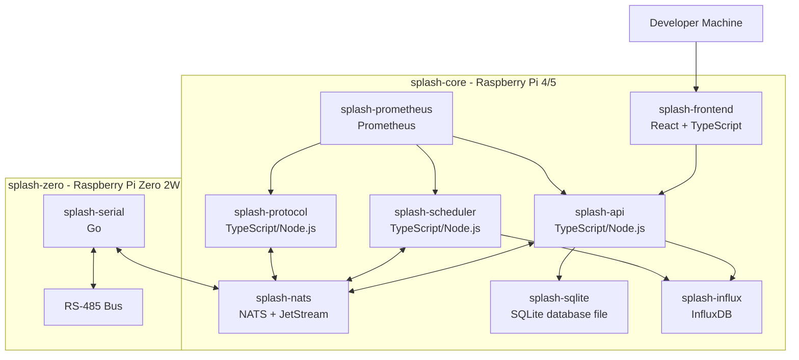
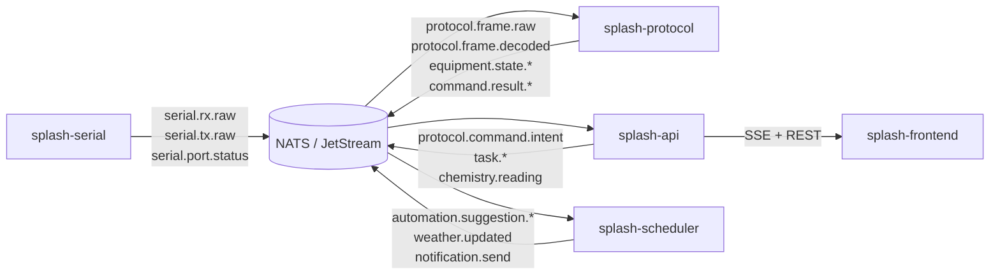
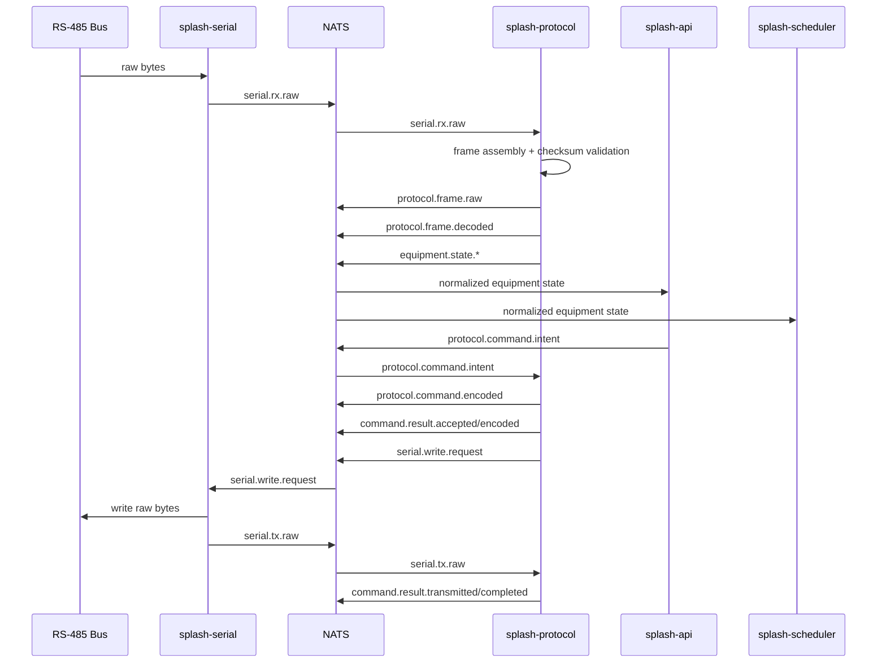
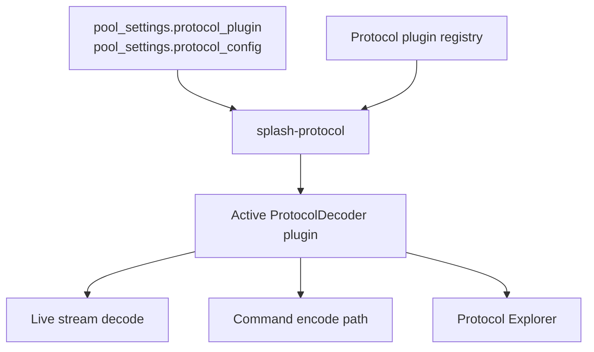

# Architecture

[Back to README](Home)

## System topology

Splash is distributed across dedicated devices on the local network:

- `splash-core` on a Raspberry Pi 4/5 runs the main services, usually as
  Ansible-managed standalone containers plus host-managed persistent storage
- `splash-zero` on a Raspberry Pi Zero 2W runs the RS-485 serial service as a `systemd`-managed native service
- developer machines may run local app services against shared infrastructure on `splash-core`



TODO: The original document says the living architecture diagram also exists in the repository or a design tool, but no separate source artifact was embedded in `splash.docx`.

## Service boundaries

Terminology such as [service](Product-Glossary#service) and
[host](Product-Glossary#host) is defined in
[Product Glossary](Product-Glossary.md).

| Service | Host | Responsibility |
| --- | --- | --- |
| `splash-api` | `splash-core` | REST API, SSE broker, envelope responses, repository access, notification worker, first-slice weather forecast cache and telemetry read model. Preferred language: TypeScript/Node.js |
| `splash-scheduler` | `splash-core` | long-term weather fetch ownership, cron jobs, automation rule evaluation, task generation. Preferred language: TypeScript/Node.js |
| `splash-protocol` | `splash-core` | plugin-based protocol decode/encode, frame reconstruction, normalized event publication, Protocol Explorer protocol operations. Preferred language: TypeScript/Node.js |
| `splash-serial` | `splash-zero` | RS-485 I/O, raw byte ingress and egress, bus timing enforcement, port monitoring. Preferred language: Go |
| `splash-nats` | `splash-core` | event backbone and JetStream durability |
| SQLite store | `splash-core` | embedded relational system of record |
| `splash-influx` | `splash-core` | time-series telemetry store |
| `splash-prometheus` | `splash-core` | service metrics scraping |
| `splash-frontend` | `splash-core` | React web UI |

## Technology stack

See [Technology Stack](Technology-Stack.md) for the detailed technology
choices.

## Deployment artifact strategy

Splash prefers package-based service artifacts wherever practical.

Rules:

- each deployable service should produce a versioned package artifact as its primary release unit
- host-installed services should prefer OS-native packages over ad hoc binary copies
- services that run in containers should still prefer a package-first build flow, with the container image acting as the runtime wrapper around a versioned packaged service build
- deployment automation should install or assemble versioned packages rather than build services directly on target hosts
- artifact publication should be compatible with Gitea-hosted package distribution

## Core architectural patterns

- Local-first, event-driven system design
- Polyglot backend, with language chosen per service responsibility
- Manual dependency injection
- Repository pattern for data access
- SSE broker for browser push
- Pluggable interfaces for protocols, weather providers, and sensor providers
- The first weather-forecast implementation may temporarily run inside
  `splash-api` until a dedicated `splash-scheduler` forecast-refresh slice is
  implemented.
- Ansible-managed independent containers plus host-managed embedded relational
  storage

## Relational storage note

- `#109` changes the canonical relational store from PostgreSQL to SQLite
- during the implementation transition, deployed code may temporarily still use
  PostgreSQL until the SQLite migration completes

## Event backbone

NATS is the integration boundary between services. High-frequency telemetry uses Core NATS, while tasks, notifications, and automation suggestions use JetStream when message durability matters.




Caption: Diagram of the internal NATS topic backbone and publisher/consumer relationships.

## Protocol integration architecture

RS-485 transport and protocol logic are separate concerns.

- `splash-serial` owns the serial port, raw byte streaming, write serialization, and bus-idle enforcement
- `splash-protocol` owns vendor-specific framing, checksum validation, decode, encode, and normalized event generation

All vendor-specific protocol logic is isolated behind `splash-protocol` and a plugin-based `ProtocolDecoder` implementation.

```ts
interface ProtocolDecoder {
  name(): string
  baudRate(): SerialConfig
  sync(reader: ByteReader): Promise<void>
  decode(raw: Uint8Array): DecodedFrame
  encode(command: NormalizedCommand): Uint8Array
}
```

Current decoder states:

- `pentair_easytouch`: implemented
- `jandy_aqualink_rs`: stubbed, pending fuller reverse engineering
- `hayward_omnilogic_local`: implied future path, not yet implemented in the source


Caption: Diagram showing the decoder plug-in approach used by the protocol service to isolate vendor-specific protocol logic.

### Protocol service flow

1. `splash-serial` reads raw RS-485 bytes and publishes them to NATS together with a durable `serial_instance_id`
2. `splash-protocol` discovers the locally available protocol plugins and selects the pool's active plugin from provider-backed pool configuration
3. `splash-protocol` reconstructs frames from the raw stream
4. `splash-protocol` validates checksums and framing
5. `splash-protocol` decodes frames into normalized events
6. `splash-protocol` publishes both protocol-level and normalized event subjects
7. `splash-api` and `splash-scheduler` consume normalized events only
8. `splash-api` publishes normalized command intent for approved actions
9. `splash-protocol` encodes command intent into raw bytes
10. `splash-protocol` publishes `serial.write.request`
11. `splash-serial` validates the active stream, enforces idle timing, and transmits the encoded bytes to the bus



## Normalized domain boundary

The platform must distinguish three layers of meaning:

1. raw transport data
2. protocol-decoded frames
3. normalized domain events and commands

The rest of the system should depend on layer 3 whenever possible.

### Layer definitions

- Raw transport data: byte chunks and serial-port status emitted by `splash-serial`
- Protocol-decoded frames: vendor-specific structured output emitted by `splash-protocol`
- Normalized domain events: platform-level equipment, chemistry, and command state used by API, scheduler, UI, and automation

### Transport identity boundary

The Pentair RS-485 wire format does not expose a Splash `pool_id`.

Rules:

- `splash-serial` should generate and persist its own durable `serial_instance_id` on first startup
- raw transport subjects should carry `serial_instance_id`, not a transport-discovered `pool_id`
- `splash-core` services may later bind one `serial_instance_id` to a controller domain or Splash pool record
- `splash-protocol` should attach `pool_id` only after a higher-level selection or binding step has resolved which pool the active stream belongs to

### Ownership

- `splash-serial` owns layer 1
- `splash-protocol` owns layers 2 and 3 translation from protocol to normalized state
- `splash-api` and `splash-scheduler` consume normalized events and emit normalized command intents

### Design rule

Application services must not make decisions based on protocol-specific action codes or vendor-specific byte fields when a normalized event exists.

The authoritative pool-equipment protocol reference material lives in [equipment-protocols.md](Protocols-Pentair-EasyTouch-Reference). That document captures known framing, checksum, addressing, command, and reverse-engineering notes for supported and planned equipment communication protocols.

The authoritative normalized application-level contract above the protocol layer lives in [normalized-contracts.md](Interfaces-Normalized-Contracts).

### Stream-state ownership

- `splash-serial` owns port lifecycle state: connected, disconnected, reconnecting, and write-blocked
- `splash-protocol` owns frame assembly state for each active `stream_id`
- `splash-protocol` is stateful per stream, not purely stateless per frame
- when `stream_id` changes, `splash-protocol` must discard any partial frame buffer from the prior stream
- raw chunk publication from `splash-serial` must preserve native serial read boundaries rather than introducing transport-side frame buffering

### Command correlation ownership

- `splash-api` creates `command_id`
- `splash-protocol` owns correlation between `protocol.command.intent`, `protocol.command.encoded`, `serial.tx.raw`, and the resulting decoded response frames
- `splash-serial` does not decide whether a command succeeded; it only reports transport-level write status
- `splash-serial` must reject stale write requests whose `stream_id` no longer matches the active port session

### Plugin availability and selection

- locally available protocol plugins are a `splash-protocol` runtime concern
- `splash-protocol` should discover available plugins from the local packaged plugin set or plugin directory at startup
- `pool_settings.protocol_plugin` selects one active plugin for the pool from that discovered set
- `pool_settings.protocol_config` supplies pool-specific plugin options
- a pool selecting a plugin that is not locally available is a fatal runtime condition because the deployment cannot satisfy the configured protocol

### Transport write contract

- `splash-protocol` publishes `serial.write.request` after encoding a command
- `splash-serial` is the only service that consumes `serial.write.request` in v1
- `serial.write.request` includes the target `stream_id`, encoded bytes, and minimum bus-idle requirement
- transport write success is reported through `serial.tx.raw`
- protocol-level success remains owned by `splash-protocol` through `command.result`

### Bus-idle enforcement model

- `splash-protocol` may specify minimum bus-idle requirements per write through `serial.write.request.bus_requirements`
- `splash-serial` owns the actual measurement and enforcement of those timing requirements
- if no plugin-specific idle requirement is supplied, `splash-serial` may use a conservative service default
- bus-idle enforcement is a transport concern, not a frame-decoding concern

### Serial service observability

- `splash-serial` should expose a minimal local HTTP surface for `GET /healthz` and `GET /metrics`
- NATS status events remain part of the platform event model, but direct local health and Prometheus scraping must not depend on NATS availability

### Plugin loading model

- protocol plugins are discovered locally by `splash-protocol` at startup, while pool configuration selects the active plugin
- a pool resolves to exactly one active protocol plugin at a time in v1
- the plugin registry is process-local to `splash-protocol`
- Protocol Explorer decode, simulate, and diff operations must use the same loaded plugin implementation as live traffic processing
- plugin identity should track protocol family and variant rather than only vendor name when one vendor exposes multiple materially different integration surfaces

ASSUMPTION: Initial protocol plugins will be built-in modules loaded by configuration rather than hot-swappable external binaries.



### Plugin configuration source

- `splash-protocol` obtains pool-level plugin selection and plugin config through a configuration-provider boundary
- in normal operation the provider may source values from `pool_settings.protocol_plugin` and `pool_settings.protocol_config`
- the active pool configuration may be cached in memory by `splash-protocol`
  for read efficiency and operator context
- cached protocol configuration must be treated as a secondary working copy, not
  as the primary source of truth for live equipment-configuration writes
- before any Splash-managed equipment configuration change is encoded,
  `splash-protocol` must fetch a fresh live configuration read from the target
  equipment/controller and build the outgoing write from that fresh baseline
- this is an application design rule for Splash safety and stale-state
  avoidance, not a blanket statement that the underlying protocol forbids
  direct write actions without a preceding read

### Plugin resolution rules

1. Obtain the active plugin selection through the configuration-provider boundary
2. Resolve it against the local plugin registry
3. Load plugin-specific options from the provider-backed protocol config
4. Reject startup or command processing if the configured plugin is unknown or invalid

### Invalid configuration behavior

- if `protocol_plugin` is missing or unknown, `splash-protocol` must emit a degraded health state
- if `protocol_config` is invalid for the selected plugin, command encoding must be blocked and a clear configuration error surfaced
- temporary configuration-provider unavailability should degrade the service rather than terminate it
- raw transport can continue even when protocol decode is degraded, but normalized event publication must pause for the affected pool until configuration is fixed

### Example plugin configuration

```json
{
  "protocol_plugin": "pentair_easytouch",
  "protocol_config": {
    "controller_type": "easytouch",
    "controller_address": "0x10",
    "pump_address_range": ["0x60", "0x6f"],
    "allow_panel_control_toggle": true
  }
}
```

ASSUMPTION: Plugin identifiers should evolve toward protocol-family-oriented names such as `pentair_easytouch`, `pentair_intellicenter`, `hayward_omnilogic_local`, or `jandy_aqualink_rs` rather than vendor-only identifiers.

## Data architecture

- SQLite stores configuration, tasks, schedules, notifications, and manual chemistry history
- InfluxDB stores time-series equipment, pump, chlorinator, weather, chemistry-sensor, and rainfall telemetry
- `pool_id` exists on child records to keep the schema ready for future multi-pool support
- protocol-level metadata may be persisted selectively for diagnostics, but raw transport traffic is not the primary system of record

## Supporting architecture documents

- [Deployment Architecture](Architecture-Deployment)
  Host layout, container and systemd runtime model, environment/config loading, and external integration placement.

- [Resilience and Health](Architecture-Resilience)
  Reconnect behavior, degraded states, dependency health, and recovery expectations.

- [Operations and Verification](Architecture-Operations)
  Testing strategy, logging, metrics, backup/recovery, and operational guidance.
